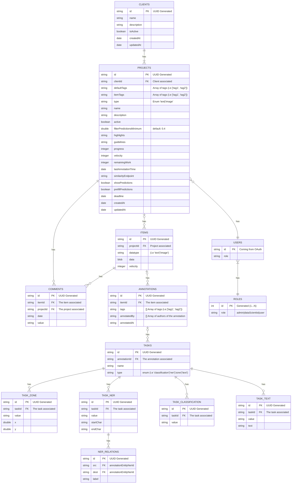

### Entity Relationship Diagram

```mermaid
erDiagram
  ITEMS ||--o{ COMMENTS : "has"
  PROJECTS ||--o{ COMMENTS : "has"
  ANNOTATIONS {
    string id PK "UUID Generated"
    string itemId FK "The item associated"
    string tags "[] Array of tags (i.e ['tag1', 'tag2'])"
    string annotatedBy "[] Array of authors of the annotation"
    string annotatedAt
  }
  COMMENTS {
    string id PK "UUID Generated"
    string itemId FK "The item associated"
    string projectId FK "The project associated"
    string date
    string value
  }
  ITEMS |o--o{ ANNOTATIONS: "has"
  ITEMS {
    string id PK "UUID Generated"
    string projectId FK "Project associated"
    string datatype "(i.e 'text'|'image')"
    blob data
    integer velocity
  }
  TASKS {
      string id PK "UUID Generated"
      string annotationId FK "The annotation associated"
      string name
      string type "enum (i.e 'classification'|'ner'|'zone'|'text')"
  }
  TASK_TEXT {
      string id PK "UUID Generated"
      string taskId FK "The task associated"
      string value
      string text
  }
  ANNOTATIONS |o--o{ TASKS: "has"
  TASK_CLASSIFICATION {
      string id PK "UUID Generated"
      string taskId FK "The task associated"
      string value
  }
  TASK_NER {
      string id PK "UUID Generated"
      string taskId FK "The task associated"
      string value
      string startChar
      string endChar
  }
  TASK_ZONE {
      string id PK "UUID Generated"
      string taskId FK "The task associated"
      string value
      double x
      double y
  }
  NER_RELATIONS {
      string id PK "UUID Generated"
      string src FK "annotationEntityNerId"
      string dest FK "annotationEntityNerId"
      string label
  }
  TASK_NER ||--o{ NER_RELATIONS: "has"

  TASKS ||--o{ TASK_ZONE: "has"
  TASKS ||--o{ TASK_NER: "has"
  TASKS ||--o{ TASK_CLASSIFICATION: "has"
  TASKS ||--o{ TASK_TEXT: "has"

  CLIENTS {
      string id PK "UUID Generated"
      string name
      string description
      boolean isActive
      date createdAt
      date updatedAt
  }

  PROJECTS {
      string id PK "UUID Generated"
      string clientId FK "Client associated"
      string defaultTags "Array of tags (i.e ['tag1', 'tag2'])"
      string itemTags "Array of tags (i.e ['tag1', 'tag2'])"
      string type "Enum 'text|'image'"
      string name
      string description
      boolean active
      double filterPredictionsMinimum "default: 0.4"
      string highlights
      string guidelines
      integer progress
      integer velocity
      integer remainingWork
      date lastAnnotationTime
      string similarityEndpoint
      boolean showPredictions
      boolean prefillPredictions
      date deadline
      date createdAt
      date updatedAt
  }

  PROJECTS |o--o{ ITEMS: "has"
  CLIENTS ||--|{ PROJECTS: "has"
  USERS {
    string id PK "Coming from OAuth"
    string role
  }

  ROLES {
      int id PK "Generated (1...N)"
      string role "admin|dataScientist|user"
  }

  USERS }|--|| ROLES: "has"
  PROJECTS }o--|| USERS: "has"
```
