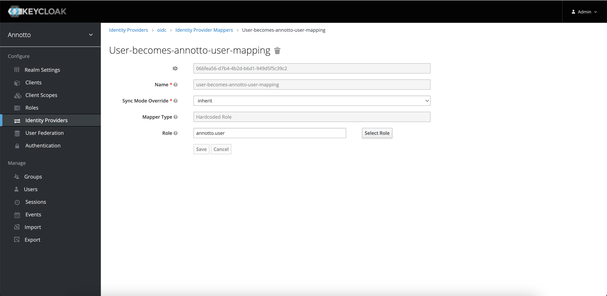

# User Management with Keycloak
Keycloak is an open source tool that helps for user authentication and authorization. It can act as a Single-Sign On solution and also provides user federation from other identity provider.

## Keycloak as SSO

To login on Annotto you have one option available by default:
1. [Keycloak Users](#keycloak-users-and-roles). Your user must be already registered in Keycloak with credentials.

### Keycloak Users and Roles
When starting keycloak with Annotto docker-compose for the first time, you will get 3 users preconfigured with three different role (`"admin"|"user"|"dataScientist'`)

1. Admin Test 
   1. Username:password = admin/test
   2. role = `admin`
2. User Test
   1. Username:password = user/test
   2. role = `user`
3. Data Test
   1. Username:password = data/test
   2. role = `dataScientist`

### SSO Microsoft
If you want to use Annotto with an SSO such as Microsoft, you can configure keycloak to leverage this Identity Provider.
A good documentation to help doing this can be found [here](https://blog.hcltechsw.com/versionvault/how-to-configure-microsoft-azure-active-directory-as-keycloak-identity-provider-to-enable-single-sign-on-for-hcl-compass/)

Once you have your Microsoft Identity Provider setup, you will also need to define a way to map your claims and roles from Microsoft to Annotto. You can do so by using a [Mapper](https://www.keycloak.org/docs/latest/server_admin/index.html#_mappers).
Here is an example of how you set an annotto `user` role to your incoming Microsoft user.


Typically, in this example, we set the role `user` at first login with Microsoft SSO. So the user is created based on the Microsoft profile and the role `user` is added to this new user in Keycloak.

#### Keycloak Helpers (import/export)
To export or to import from keycloak, you have to launch a keycloak container with a specific configuration
**EXPORT**
This will export everything from your keycloak instance based on the postgresql DB passed in envs vars:

```shell
docker run --rm\
    --name keycloak_exporter\
    -v /tmp:/tmp/keycloak-export:Z\
    -e POSTGRES_DATABASE=keycloak\
    -e POSTGRES_PASSWORD=PASSOWRD_PLEASE\
    -e POSTGRES_USER=keycloak\
    -e DB_VENDOR=POSTGRES\
    -e POSTGRES_PORT_5432_TCP_ADDR=postgresql.local\
    jboss/keycloak:16.1.1\
    -Dkeycloak.migration.action=export\
    -Dkeycloak.migration.provider=dir\
    -Dkeycloak.migration.dir=/tmp/keycloak-export\
    -Dkeycloak.migration.usersExportStrategy=SAME_FILE\
    -Dkeycloak.migration.realmName=Cincity-Realm
```
**IMPORT**
This will import data to keycloak postgresql database:

```shell
docker run --rm\
    --name keycloak_importer\
    -v /tmp:/tmp/keycloak-import:Z\
    -e POSTGRES_DATABASE=keycloak_dest\
    -e POSTGRES_PASSWORD=PASSOWRD_DEST_PLEASE\
    -e POSTGRES_USER=keycloak\
    -e DB_VENDOR=POSTGRES\
    -e POSTGRES_PORT_5432_TCP_ADDR=postgresql2.local\
    jboss/keycloak:15.0.0\
    -Dkeycloak.migration.action=import\
    -Dkeycloak.migration.provider=dir\
    -Dkeycloak.migration.dir=/tmp/keycloak-import\
    -Dkeycloak.migration.strategy=IGNORE_EXISTING\
    -Dkeycloak.migration.usersExportStrategy=SAME_FILE\
    -Dkeycloak.migration.realmName=therealm
```


